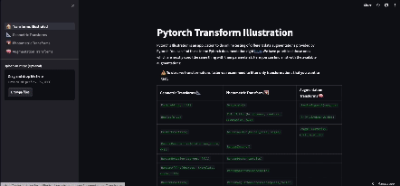

# Pytorch Transform Illustration

Welcome to the PyTorch Transformation Illustrations, an interactive application that allows users to visualize and test PyTorch data augmentation transformations. This tool is designed to help data scientists, machine learning engineers, and researchers explore the effects of various transformations on their data, making it easier to fine-tune data augmentation strategies for deep learning projects.

Test App: [https://pytorch-transform-illustrations.streamlit.app](https://pytorch-transform-illustrations.streamlit.app/)



## **Getting Started**

1. **Installation**:
    - Make sure you have Python installed on your system.
    - Clone this repository:
    
    ```bash
    git clone https://github.com/diegulio/pytorch-transform-illustrations
    ```
    
    - Install the required dependencies:
    
    ```bash
    pip install -r requirements.txt
    ```
    
2. **Launch the Application**:
    - Run the following command to start the PyTorch Transformation Visualizer:
    
    ```bash
    streamlit run 0_🏠_Transforms_Illustrated.py
    ```
    
    The application will launch in your web browser at **`http://localhost`**.
    
3. **Explore Transformations**:
    - Choose from a wide range of PyTorch transformations.
    - Upload your own image or use the default one.
4. **Visualize and Test**:
    - Apply transformations to your data interactively.
    - Observe the effects of each transformation in real-time.
5. **Save Configurations**:
    - Save your data augmentation configurations for future reference.

## **How to Contribute**

We welcome contributions from the open-source community to improve and enhance this PyTorch Transformation Illustrated. Here's how you can get involved:

### **Reporting Issues**

If you encounter any issues, bugs, or unexpected behavior, please open an issue on our GitHub repository. When reporting issues, please include the following information:

- A detailed description of the problem.
- Steps to reproduce the issue.
- Expected behavior.
- Any relevant screenshots or error messages.

### **Submitting Pull Requests**

If you'd like to contribute code to this project, follow these steps:

1. Fork this repository to your GitHub account.
2. Create a new branch in your fork for your feature or bug fix.
3. Make your changes, and ensure your code is well-documented.
4. Test your changes thoroughly.
5. Create a pull request against the **`main`** branch of this repository, explaining the purpose of your changes.

### **Adding New Features**

We encourage the addition of new features that can make this tool even more useful. If you have ideas for new features or enhancements, feel free to discuss them in the issues section or implement them directly as new pull requests.

### **Documentation**

Contributions to improve and expand the documentation are highly appreciated. Clear and well-documented code, along with updated user guides, can help us maintain a high-quality tool.

Thank you for considering contributing to the PyTorch Transformation Visualizer! Your help is invaluable in making this tool more powerful and accessible to the community.

## **License**

This project is licensed under the MIT License - see the [LICENSE](https://chat.openai.com/c/LICENSE) file for details.